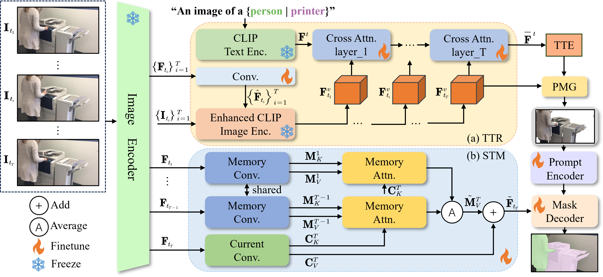
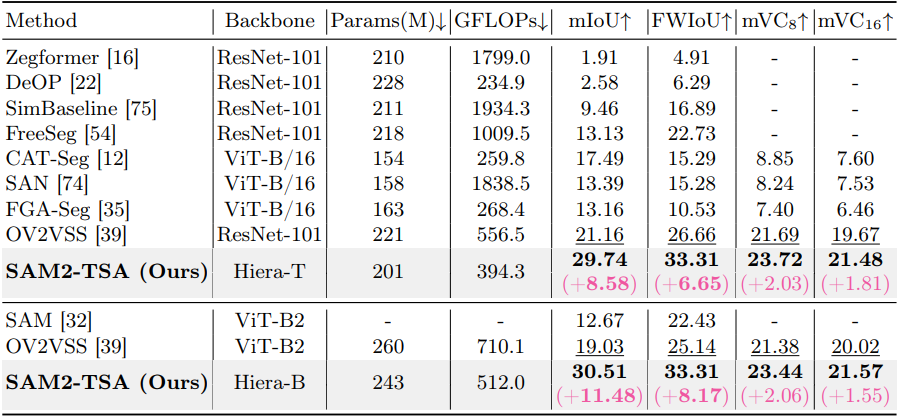
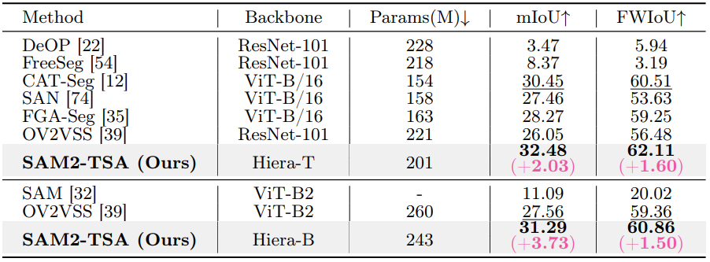

# SAM2-TSA: Temporal-Semantic-Aware Adaptation for Open-Vocabulary Video Semantic Segmentation
> **Abstract:** Open-vocabulary semantic segmentation has recently emerged as an important task in the vision community. Although substantial progress has been made in the image domain, its extension to videos remains relatively underexplored. In addition, directly applying image-based models to video fails to exploit temporal dependencies, leading to suboptimal performance-including inaccuracy and low temporal consistency. In this work, we build on a well-known foundation model Segment Anything model 2 (SAM2) and propose a novel framework tailored for open-vocabulary video semantic segmentation. Specifically, to endow SAM2 with open-vocabulary capability, we introduce a Temporal-aware Text Refiner (TTR) module that leverages temporal vision information across frames to refine text information, generating Temporal-aware Text Embedding (TTE). Next, the obtained text embedding is used to compute high-quality pseudo-masks, which serve as effective prompts for the mask decoder. Furthermore, since original SAM2's memory is designed to capture the characteristics of the target object, we replace it with a Semantic-aware Temporal Memory (STM) module that explicitly models semantic relationships between the current frame and memory frames. Extensive experiments on two popular datasets demonstrate the effectiveness of our approach, surpassing the existing SOTA method by a mIoU of 11.48% on the VSPW dataset.

---

## Overall

---

## 🔎 Results

Quantitative and Qualitative Results

- Results in Tab. 1 and Fig. 3 of the main paper on the VSPW dataset

  
  

- Results in Tab. 2 of the main paper on the Cityscapes dataset

  

---

## 💡 Acknowledgements

This project is based on [SAM2](https://github.com/facebookresearch/sam2).
